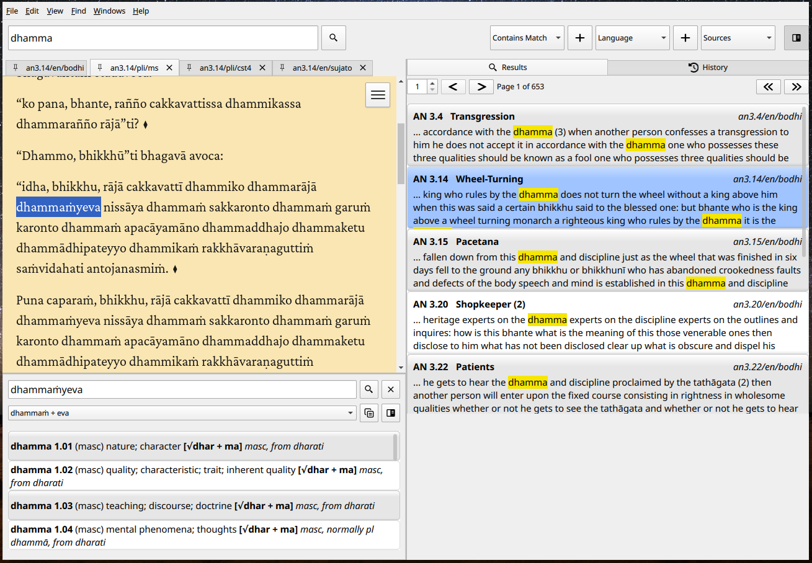
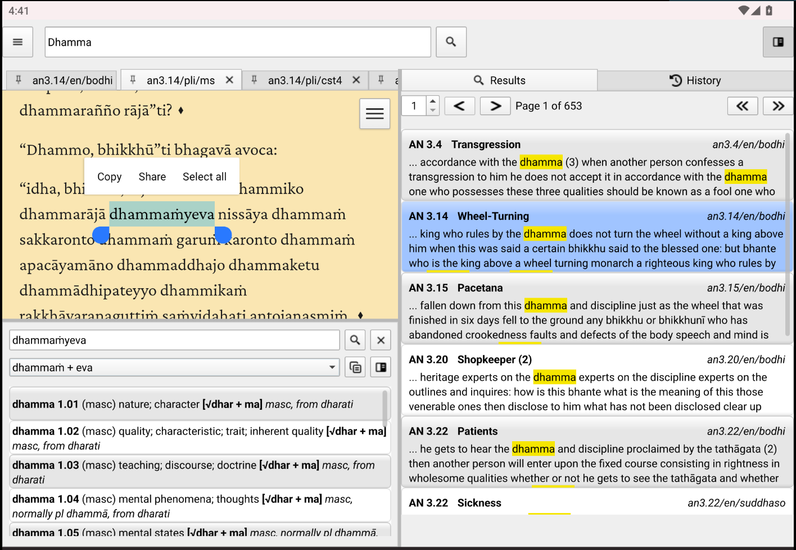

# Simsapa Dhamma Reader

A sutta reader and Pali dictionary application.

This is the next-gen rewrite in Rust using CXX-Qt. (The previous was Python + Qt: [simsapa/simsapa](https://github.com/simsapa/simsapa/))

This is at very early stages, but some basics already work:

Linux:



Android:



## Building

### Prerequisites

- MacOS (.dmg): Qt 6.10.1
- Linux (.Appimage) and Android (.apk): Qt 6.8.3
- Rust (latest stable)
- CMake 3.24+
- Platform-specific build tools

### Development Build

```bash
# Build the project
make build -B

# Run the application
make run
```

### Distribution Packages

#### Linux AppImage

```bash
# Build AppImage
make appimage -B

# Or with custom options
./build-appimage.sh --app-version v0.2.0 --os-suffix -ubuntu24

# Clean rebuild
make appimage-rebuild
```

#### macOS .app and DMG

```bash
# Build both .app bundle and .dmg
make macos -B

# Or build only .app bundle (skip DMG creation)
make macos-app

# Clean rebuild
make macos-rebuild
```

The macOS build will:
- Create a properly bundled .app in `./dist/Simsapa.app`
- Bundle all Qt frameworks and dependencies using `macdeployqt`
- Create a styled DMG installer: `Simsapa-vX.X.X-{arch}.dmg`

**Note:** For distribution, you may want to code sign the app. Set the `APPLE_SIGNING_IDENTITY` environment variable:

```bash
export APPLE_SIGNING_IDENTITY="Developer ID Application: Your Name (TEAM_ID)"
make macos
```

#### Android APK

Build using Qt Creator with the Android kit configured.

### Testing

```bash
# Run all tests
make test

# Individual test suites
make rust-test   # Backend tests
make qml-test    # QML tests
make js-test     # JavaScript tests
```
